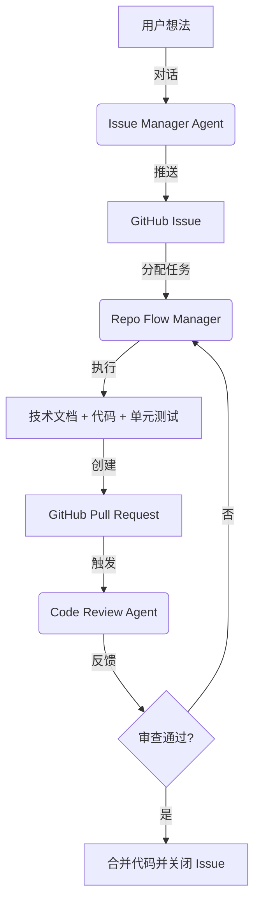

# 研发流水线联动指南 (Orchestrator)

本指南说明了如何让三个智能体在 Claude 中高效联动，形成从“想法”到“高质量合并”的闭环。

## 联动链路图

## 自动化联动机制

为了实现高效协作，Claude 会根据上下文或关键词自动识别并建议运行对应工作流。

| 流程 | 激活关键词 | 触发时机 |
| :--- | :--- | :--- |
| **Issue Manager** | `新需求`, `创建任务` | 初始需求讨论阶段。 |
| **Repo Flow Manager** | `开始开发`, `领取任务` | 当 Issue 创建成功，或者准备开始编码时。 |
| **Code Review Agent** | `代码审查`, `提交代码` | 当代码完成、创建 PR 或需要质量检查时。 |

### 3. 质量把控 (PR -> Merge)
- **指令**: "开启代码审查" 或 "启动 Code Review"。
- **联动点**: 
  - **手动**: 您可以直接要求对当前的 PR 进行审查。
  - **自动 (CI)**: `code-review.md` 中定义的逻辑可以集成在 GitHub Action 中。

## 智能体间的上下文传递
- **仓库**: 所有智能体都基于当前工作区的 Git 仓库。
- **引用**: `repo-flow-manager` 会在 PR 描述中自动包含 `Closes #<IssueID>`。
- **文档**: `repo-flow-manager` 生成的技术文档存储在 `docs/tech/`，作为 `code-review` 审查背景的重要输入。

---

## 协作秘籍
如果您想一气呵成，可以直接下令：
> "启动全流程：先帮我梳理 [XX功能] 的需求并创建 Issue，然后立即领取该任务开始开发，完成后提交 PR 并进行自我审查。"

Claude 会识别意图并依次调用对应工作流的逻辑。
