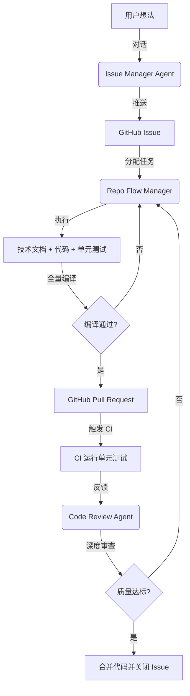

# 研发流水线联动指南 (Orchestrator)

本指南说明了如何让三个智能体在 Claude 中高效联动，形成从“想法”到“高质量合并”的闭环。

## 联动链路图

## 自动化策略

Claude 会根据以下状态自动切换工作流：

1. **需求定义**: 使用 `Issue Manager` 梳理需求并推送到远程 Issue。
2. **闭环开发**: 使用 `Repo Flow Manager` 领取 Issue。**必须强制执行影响评估 (Impact Analysis)**，防止破坏周边工具。
3. **安全提交**: 在本地完成 `go build ./...` 全量校验。**禁止在本地运行单测**。
4. **CI 验收**: 提交 PR 后，通过 CI 反馈和 `Code Review Agent` 完成最终质量把关。

## 协作秘籍

如果您想一气呵成，可以直接下令：
> "启动全流程：先帮我梳理 [XX功能] 的需求并创建 Issue，然后立即领取该任务开始开发，完成后提交 PR 并进行自我审查。"

---

## 注意事项
- 严禁跳过 **影响评估**。
- 严禁跳过 **全量编译校验**。
- 单测必须具备 **CI 可运行性**。