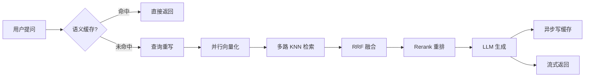

# PaiSmart 系统优化 - 3.1 / 3.2 / 3.3 实现记录

本文档记录了 IMPROVEMENT_PLAN.md 中 3.1 语义缓存、3.2 查询重写、3.3 Markdown 切分器整合三项功能的实现细节。

---

## 3.1 语义缓存 (Semantic Cache)

**目标**: 避免重复回答语义相似的问题，降低 LLM Token 成本。

### 新增文件

#### [content_cache_service.go](file:///c:/Users/biodog/Desktop/rag/rag/internal/service/content_cache_service.go) `[NEW]`
- 定义 `ContentCacheService` 接口：`GetCachedResponse` / `CacheResponse`
- 使用 Redis Set 维护缓存索引，每个条目存储 `queryVector + response + timestamp`
- 余弦相似度阈值：**0.95**（可通过 `WithThreshold` 配置）
- 缓存 TTL：24 小时
- 采用 **Functional Options** 模式注入 Redis / Embedding 客户端

### 修改文件

#### [chat_service.go](file:///c:/Users/biodog/Desktop/rag/rag/internal/service/chat_service.go)
```diff
 type chatService struct {
+    cacheService     ContentCacheService
+    embeddingClient  embedding.Client
 }
```
- `StreamResponse` 新增步骤 0：向量化查询 → 查语义缓存 → 命中则直接返回
- 在 LLM 流式响应完成后，异步写入语义缓存

#### [main.go](file:///c:/Users/biodog/Desktop/rag/rag/cmd/server/main.go)
- `NewContentCacheService` 改为注入 `WithRedisClient` + `WithEmbeddingClient`
- `NewChatService` 增加 `embeddingClient` 参数

---

## 3.2 查询重写 (Query Rewriting / Multi-Query)

**目标**: 通过 LLM 生成多个语义等价但表述不同的查询变体，并行检索以提升召回率。

### 修改文件

#### [search_service.go](file:///c:/Users/biodog/Desktop/rag/rag/internal/service/search_service.go)

**新增方法: `rewriteQueries`**
- 调用 LLM 将用户问题重写为 2-3 个变体（同义词替换 / 角度转换 / 抽象具体化）
- JSON 格式解析，失败则降级为仅使用原始查询

**新增函数: `deduplicateDocs`**
- 根据 `VectorID` 对多路向量检索结果去重

**HybridSearch 流程变更:**
```
步骤 3: 查询重写 → 生成 allQueries[]
步骤 4: 并行向量化所有查询
步骤 5: 多路并行召回
  - 5.1 每个查询向量独立执行 KNN 检索
  - 5.2 关键词检索 (不变)
步骤 6: RRF 融合 (不变)
```

---

## 3.3 Markdown 切分器整合

**目标**: 对 `.md` 文件使用标题感知切分，保持章节完整性。

### 修改文件

#### [processor.go](file:///c:/Users/biodog/Desktop/rag/rag/internal/pipeline/processor.go)
- 新增导入 `pai-smart-go/pkg/splitter`
- `splitText` 增加 `fileName` 参数
- 新增 `isMarkdownFile` 辅助函数：检测 `.md` / `.markdown` 扩展名
- Markdown 文件路由到 `splitter.NewMarkdownSplitter().Split()`
- 非 Markdown 文件或 `MarkdownSplitter` 无结果时降级为简单字符切分

#### [splitter.go](file:///c:/Users/biodog/Desktop/rag/rag/pkg/splitter/splitter.go) `[NEW]` *(本次会话早期创建)*
- 定义 `TextSplitter` 接口和 `SimpleTextSplitter` 实现
- `MarkdownSplitter` 的基础依赖

---

## 架构影响



## 降级策略

| 组件 | 失败场景 | 降级行为 |
|:---|:---|:---|
| 语义缓存 | Redis 不可用 / Embedding 失败 | 跳过缓存，走完整 RAG 流程 |
| 查询重写 | LLM 调用失败 / JSON 解析失败 | 仅使用原始查询 |
| Markdown 切分 | 非 `.md` 文件 / 切分结果为空 | 降级为简单字符切分 |
