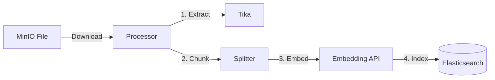
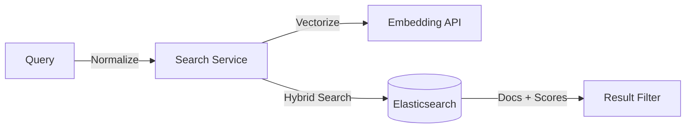

# PaiSmart RAG 核心功能代码分析

本文档详细解析了 PaiSmart 项目中 RAG (Retrieval-Augmented Generation) 功能的核心代码实现、文件位置及逻辑流程。

## 1. 核心代码位置概览

RAG 功能主要分布在以下三个核心目录中，遵循 Clean Architecture 分层架构：

| 模块 | 职责 | 核心文件路径 | 关键结构体/函数 |
| :--- | :--- | :--- | :--- |
| **Indexing** | 知识库构建 (ETL) | `internal/pipeline/processor.go` | `Processor.Process`, `splitText` |
| **Retrieval** | 混合检索与排序 | `internal/service/search_service.go` | `HybridSearch`, `normalizeQuery` |
| **Generation** | 对话生成与流式响应 | `internal/service/chat_service.go` | `StreamResponse`, `buildSystemMessage` |

---

## 2. 深入解析

### 2.1 知识库构建 (Indexing)

**文件**: `internal/pipeline/processor.go`

负责将用户上传的文档转化为向量存储到 Elasticsearch 中。这是一个基于 Kafka 消息驱动的异步处理流程。

**关键逻辑**:
1.  **文本提取**: 调用 `tika` 客户端提取文档纯文本 (`p.tikaClient.ExtractText`)。
2.  **智能分块**: 实现了一个滑动窗口切分算法 `splitText` (ChunkSize=1000, Overlap=100)，确保上下文连续性，逻辑对齐 Java 版 `CharacterTextSplitter`。
3.  **向量化与存储**:
    - 遍历所有 Chunk，调用 Embedding API 生成向量。
    - 构造 `model.EsDocument` 对象，包含 `vector`、`text_content` 及权限字段 (`user_id`, `org_tag`)。
    - 调用 `es.IndexDocument` 写入 Elasticsearch。
    - **幂等性**: 处理前会先清理该文件在 MySQL 中的旧分块记录。

### 2.2 混合检索 (Hybrid Retrieval)

**文件**: `internal/service/search_service.go`

实现了“语义检索 + 关键词检索”的混合搜索策略，这是系统的核心竞争力。

**核心逻辑 (`HybridSearch`)**:
1.  **Query 预处理**:
    - `normalizeQuery`: 去除“请问”、“是什么”等无意义停用词，提取核心短语。
    - 向量化: 将 Query 转换为向量。
2.  **复杂查询构建 (ES DSL)**:
    - **kNN**: 向量相似度检索 (TopK * 30)。
    - **Bool Query**:
        - `Must Match`: 确保包含核心关键词。
        - **`Filter` (权限控制)**: 强制过滤 `(user_id=Current OR is_public=true OR org_tag IN Tags)`。
        - `Should Match Phrase`: 对连续短语进行加权 (Boost=3.0)。
    - **Rescore (重排序)**: 结合 BM25 分数调整最终 TopK 排名 (权重 0.2 vs 1.0)。
3.  **兜底重试**: 若首次检索无结果，尝试仅使用核心短语进行宽泛检索。

### 2.3 生成与流式响应 (Generation)

**文件**: `internal/service/chat_service.go`

负责协调检索结果、组装 Prompt 并与 LLM 进行流式交互。

**核心逻辑 (`StreamResponse`)**:
1.  **上下文组装**:
    - 调用 `HybridSearch` 获取 Top-10 相关切片。
    - 格式化为 `[1] (filename) content...` 形式。
    - `buildSystemMessage`: 结合 `config.yaml` 中的 Prompt 规则与上下文，生成 System Message。
2.  **流式交互 (Streaming)**:
    - 调用 `llmClient.StreamChatMessages`。
    - 使用 `wsWriterInterceptor` 拦截 LLM 的输出字符。
    - 实时封装为 JSON (`{"chunk": "..."}`) 通过 WebSocket 推送给前端。
3.  **历史归档**: 对话结束后，将完整的 [User Query, AI Answer] 存入 Redis/Database。

---

## 3. 关键配置与修改说明

如果您需要调整 RAG 效果，请关注以下位置：

| 参数 | 当前值 | 修改位置 | 作用 |
| :--- | :--- | :--- | :--- |
| **Chunk Size** | 1000 | `internal/pipeline/processor.go` (代码硬编码) | 决定切片粒度，影响上下文完整性 |
| **Top K** | 10 | `internal/service/chat_service.go` (line 42) | 决定每轮对话引用的片段数量 |
| **Prompt Template** | 自定义规则 | `configs/config.yaml` (`llm.prompt.rules`) | 影响 LLM 的回答风格和引用格式 |
| **Search Boost** | 3.0 | `internal/service/search_service.go` (`buildPhraseShould`) | 关键词短语匹配的权重 |
