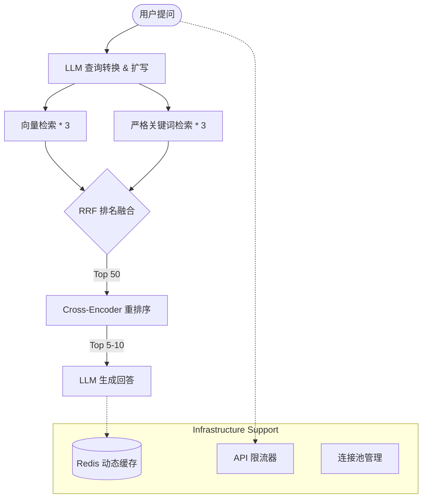

# PaiSmart RAG 检索策略与系统优化技术总纲

> **更新日期**: 2026-03-13  
> **文档说明**: 本文档汇总了项目从初版到生产级高性能版本的所有核心技术优化，涵盖了向量化流水线、检索策略演进及系统基础设施增强。

---

## 1. 向量化流水线优化 (Pipeline Optimization)

### 1.1 批量向量化 (Batch Embedding)
- **改进前**: 逐个分块调用 Embedding API，网络往返开销极其严重。
- **改进后**: 将 10 个分块合并为一个批次提交给 API。
- **收益**: 减少了 90% 的 HTTP 请求次数，显著降低了 API 成本并提升了处理效率。

### 1.2 并发 Worker 池 (Concurrent Processing)
- **设计**: 在 `Processor` 中引入带信号量控制的并发模型（默认 5 路并发）。
- **实现**: `sem := make(chan struct{}, 5)`，确保在大文件处理时既能压榨 CPU/IO 性能，又不会压垮下游 API 服务。

### 1.3 自适应与函数级切分 (Adaptive & CodeAware Splitting)
- **策略**: 针对 Markdown、代码 (Go, Python, Java 等) 和普通文本采用不同的 `chunkSize`。
- **创新**: 引入 `CodeSplitter`，利用正则表达式识别语言特征（如 `func`、`def`），尽量保证函数和类的语义完整性，避免生硬地按字符数切断代码。

---

## 2. 检索策略演进 (Search Strategy Evolution)

### 2.1 检索融合 (Hybrid Search & RRF)
- **设计**: 利用 **Reciprocal Rank Fusion (RRF)** 算法。
- **逻辑**: 将“向量搜索”的语义广度与“关键词搜索”的字面精准度进行排名融合，消除了异构分数无法直接相加的问题。

### 2.2 重排序精排 (Cross-Encoder Rerank)
- **地位**: 检索流水线的“终极面试官”。
- **流程**: 对 RRF 召回的 Top-50 片段调用重排序模型进行深度语义打分。它能读懂细微逻辑（如否定词），确保最终返回给 LLM 的 Top-5 片段是绝对相关的。

### 2.3 查询转换 (Query Transformation) [最新版本]
为了解决口语化提问和指代不明的问题，引入了 LLM 预处理层：
- **指代消解**: 结合最近 3 轮历史，补全“那个怎么用”中的主语。
- **Query 重写**: 将“退保咋整”等口语转为“保险退保的操作路径”。
- **多路扩写**: 一次提问生成 3 个精准变体，由 100% 严格匹配策略兜底。

### 2.4 旧版本回顾：索引松绑 (Relaxed Retrieval)
- **历史记录**: 曾尝试通过 `minimum_should_match: 70%` 降低 ES 过滤门槛。
- **对比**: 虽能提升召回，但会引入噪声。在 2.0 版本中已通过“多路扩写 + 严格匹配”的组合方案完美取代。

---

## 3. 基础设施与生产安全 (Infrastructure & Security)

### 3.1 连接池与自动重试 (Connection Management)
- **ES 优化**: 配置 `MaxIdleConns: 10` 和 `IdleConnTimeout: 90s`。
- **容错**: 针对 502/503/504 状态码增加自动重试逻辑，提升了网络抖动时的系统生存率。

### 3.2 动态缓存策略 (Dynamic Cache TTL)
- **逻辑**: 在 Redis 中实时统计查询频率。
- **分级**: 极热点请求缓存 7 天，中频请求缓存 24 小时，冷数据 1 小时释放，优化了 Redis 内存负载。

### 3.3 系统安全与观测 (Security & Observability)
- **接口限流**: `RateLimiter` 默认 10 QPS/用户，防止恶意攻击和资源滥用。
- **日志脱敏**: 使用正则自动遮蔽日志中的 `Token`、`Password` 等敏感字段。
- **慢查询日志**: 检索时间超过 **2 秒** 的请求会被标记为 `SlowQuery`，便于后续针对性调优。

---

## 4. 总结：高性能 RAG 流水线全视图

**结论**: 现在的系统已不再是简单的“搜一段、回一段”，而是一个在大规模并发下依然稳健、能够精准理解意图并防御风险的生产级 RAG 引擎。
